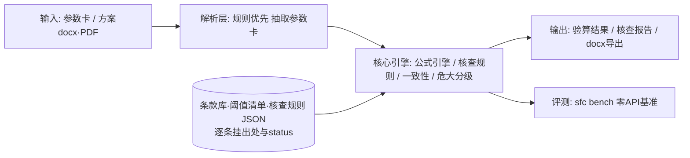

# scaffold-formwork-checker

🚧 **开发中（M5 桌面交付完成，v0.5.0）** · 脚手架与模板支架安全验算及危大分级工具

[](https://github.com/yuluo554/scaffold-formwork-checker/actions/workflows/ci.yml)

面向施工安全领域的规范驱动桌面工具（Windows，全离线）：

- **安全验算**：JGJ 130-2011 / JGJ 162-2008 规范公式验算（立杆稳定性、水平杆抗弯挠度、连墙件、地基承载力、模板支架立杆稳定），结论逐条挂条款号，计算过程透明；
- **专项方案文本核查**：解析专项施工方案（docx/PDF 文本）为参数卡，对照规范构造限值核查，并检测"方案 vs 验算书"两张皮一致性；
- **危大分级判定**：住建部令第 37 号 + 建办质〔2018〕31 号阈值清单化，三级判定（非危大 / 危大 / 超过一定规模须专家论证），结论挂文件+条款+原文摘录；
- **报告导出**：docx 验算书与核查报告（无时间戳、零外链、内置免责声明）；
- **桌面 GUI 与免安装 exe**：PySide6 五页签（验算/方案核查/一致性/危大分级/基准）只消费引擎 API；PyInstaller 打包双 exe，数据内嵌、完全离线。

## 当前状态

M5 桌面交付完成（PySide6 五页签 GUI + `sfc gui`；PyInstaller onedir 双 exe，数据内嵌冻结分支 + spec 白名单 + 构建后禁区扫描/内嵌数据对账断言；中立目录+剥离 PATH 干净验证全过；304 tests 全绿）。功能模块按里程碑推进，见下表；详细计划在 [plan/00-README总览.md](plan/00-README总览.md)。

| 里程碑 | 内容 | 状态 |
|---|---|---|
| M1 | 数据先行：条款库（原文核对纪律）+ 危大阈值清单 + 算例真值库 + 合成方案生成器 | ✅ 2026-10-07 |
| M2 | 公式引擎：5+1 验算模块，算例回归通过率 100% | ✅ 2026-10-07 |
| M3 | 方案解析 + 构造限值核查 + 两张皮一致性检测 + 危大分级判定器 | ✅ 2026-10-07 |
| M4 | 内置基准 `sfc bench`（零 API 依赖）+ docx 报告导出 `sfc report` | ✅ 2026-10-07 |
| M5 | PySide6 五页签 GUI（只消费引擎 API）+ PyInstaller 双 exe（数据内嵌+构建红线断言）+ 技术报告 | ✅ 2026-10-07 |
| M6 | 脱敏发布 GitHub + Release（exe + 演示） | ⬜ |

## 快速开始（当前骨架）

环境要求：Python 3.8+。

Windows（Git Bash / CMD，建议 `py` 启动器）：

```bash
py -m venv .venv
.venv/Scripts/python -m pip install -U pip
.venv/Scripts/python -m pip install -e ".[dev]"
.venv/Scripts/sfc --version
.venv/Scripts/sfc selfcheck
.venv/Scripts/python -m pytest tests -v
```

CLI 验算（参数卡 JSON，见 [data/examples/](data/examples/) 内各例 `input_card` 的形态）：

```bash
.venv/Scripts/sfc calc 参数卡.json                 # 自动识别模块（M-1~M-6）
.venv/Scripts/sfc calc 参数卡.json --module M-1    # 显式指定模块
# 输出：checks（item/expr/substituted/ratio/limit/verdict/clause_refs）+ detail（中间量）
# 退出码：0=完成；1=降级完成（依据未核对被拦截）；2=输入不可用/参数错误
```

CLI 方案核查与危大分级（M3，专项施工方案 docx/PDF 文本路线）：

```bash
.venv/Scripts/sfc check 专项施工方案.docx          # 解析→构造限值核查+两张皮+分级联动
# 输出：scheme_card/calcbook_card + findings（违规清单）+ confirmations（待人工确认）+ grading
# 退出码：0=无违规无待确认；1=存在违规或待人工确认项；2=输入不可用/解析失败

.venv/Scripts/sfc grade 专项施工方案.docx          # 仅危大分级判定
.venv/Scripts/sfc grade 专项施工方案.pdf --param build_height=56
# 输出：分级结论（非危大/危大/超过一定规模）+ 义务提示 + 依据摘录（31号文附件原文）
# 退出码：0=判定完成；1=参数缺失/类型未识别（待人工确认）；2=输入不可用
```

CLI 基准与报告导出（M4）：

```bash
.venv/Scripts/sfc bench                            # examples/synthetic/grading 三套件一条命令
# 输出：三套件指标 + targets 达标判定（README 基准表同源）
# 退出码：0=全部指标达标；1=有指标未达标（完整指标仍输出）；2=数据目录不可用

.venv/Scripts/sfc report calc 参数卡.json -o 验算书.docx      # 验算书 docx
.venv/Scripts/sfc report check 专项施工方案.docx -o 核查报告.docx
# 产物：封面/参数卡表/逐项验算（或逐项核查）/违规清单/分级结论/待人工确认项/免责声明（强制）
# 纪律：无时间戳（签署栏手填）、零外链；同输入位级一致（tests/test_report_*.py 锁定）
# 退出码：0=报告已生成且无违规/待确认；1=报告已生成但内容含违规或待确认项；2=输入不可用
```

> 文本路线说明：解析只读文档文本（零识图、零 LLM）。扫描件/图片表格不可读，
> 对应参数进"待人工确认"而非猜测；真实 PDF 版式兼容性属已知限制。

桌面 GUI（PySide6 五页签，同一引擎）：

```bash
.venv/Scripts/python -m pip install -e ".[gui]"     # PySide6>=6.6,<6.7（py3.8 实测上限 6.6.3.1）
.venv/Scripts/sfc gui                               # 或 .venv/Scripts/sfc-gui
# 页签：验算（模块表单+导出验算书）/ 方案核查（违规+待确认+导出报告）/
#       一致性（两卡差异）/ 危大分级（结论+义务+依据摘录）/ 基准（三套件指标）
```

免安装 exe（PyInstaller onedir 双入口，数据内嵌、完全离线）：

```bash
.venv/Scripts/python -m pip install -e ".[build]"   # pyinstaller>=5.13,<6（py3.8 稳妥通道）
.venv/Scripts/python tools/build_exe.py             # 构建 + 构建后断言（禁区扫描+内嵌数据对账）
# dist/sfc/sfc.exe     CLI 控制台（selfcheck/calc/check/grade/bench/report 五连可用）
# dist/sfc/sfc-gui.exe 桌面 GUI（--probe 无头自检）
# 版权红线：规范原文全文（data/knowledge/raw/）绝不入包；入包数据=包内规则表+条款库+算例库+合成 fixtures 共 46 份
```

界面截图（五页签真实运行态）：[docs/images/](docs/images/)；技术报告见 [docs/技术报告.md](docs/技术报告.md)。

Linux / macOS：

```bash
python3 -m venv .venv
.venv/bin/python -m pip install -U pip
.venv/bin/python -m pip install -e ".[dev]"
.venv/bin/sfc --version
.venv/bin/sfc selfcheck
```

> 老版本 pip（如 py3.8 自带 20.x）无法可编辑安装 pyproject-only 项目，先执行 `pip install -U pip` 再安装。

## 架构



设计原则：数值结论永远来自确定性规则（零 LLM 通路）；未经原文核对（status）的条文数值不进入计算路径；CLI/GUI 消费同一引擎 API。详见 [plan/03-架构与技术选型.md](plan/03-架构与技术选型.md)。

## 评测基准（M4 正式版，`sfc bench` 一条命令复跑本表）

**算例真值回归**（bench examples 套件；pytest 守门 `tests/test_engine_regression.py`、`tests/test_bench_suites.py`）：

| 套件 | 用例数 | 通过率 | 说明 |
|---|---|---|---|
| examples 算例回归 | 13 | **100%**（13/13） | 覆盖 M-1~M-6 全部主路径 + 2 条不合格路径；checks 比值容差内 + 中间量逐项对账 |
| 参数扫描回归 | 10 组 | 单调性/边界全锁 | H/活载/步距/横距/风压等关键参数单调性 + λ=250 表档→公式边界 |
| 条文纪律 | — | 拦截 100% | 任一依赖条目待核对 → 模块整体拒绝计算（双层拦截，测试锁死） |

**合成方案核查基准**（bench synthetic 套件；pytest 守门 `tests/test_m3_synthetic_eval.py`）：

| 指标 | 数值 | 说明 |
|---|---|---|
| 检出率（recall） | **100%**（14/14 期望违规全命中） | 12 冻结 fixtures（5 类注入×2+干净对照×2），按"全部非 pass 集合"对账 |
| 误报 | **0**（含干净对照 0 误报） | 输出多出的非 pass 项计 0 |
| F1 / 精确率 | **1.0** | 数值字段（actual/limit_value）与条款号严格对账 |
| 逐类注入检出率 | 5 类各 **100%** | step_over / walltie_over / brace_missing / two_sheets / grading_missing |

**危大分级判定基准**（bench grading 套件，35 用例；pytest 守门 `tests/test_grading.py`、`tests/test_bench_suites.py`）：通过率 **100%**（35/35——落地架 23.9/24.0/24.1、49.9/50.0/50.1 双档全边界，悬挑 20m、附着 150m、承重 7kN ±ε，模板支撑危大 5 条件+超规模 4 条件全边界，参数缺失 pending 2 例）。

全部零 API、离线、确定性可复现；`sfc bench` 一条命令复跑本表并按达标门限（examples 通过率 100%、synthetic F1≥0.95 且误报 0、grading 通过率 100%）给出退出码。

## 目录

```
src/scaffold_formwork_checker/   核心包（engine/parse/rules/grading/report/bench/gui/packaging）
tools/                           生成器·打包（sfc.spec+build_exe.py）·截图脚本
tests/                           pytest（含退出码语义/冻结分支/打包纪律等守门测试）
data/                            条款库·算例库·合成 fixtures（台账见 data/README.md）
plan/                            计划文档（00 总览 / 01 题目 / 02-06 详设 / HANDOFF 交接）
docs/                            技术报告 + 界面截图
```

## 免责声明

本工具定位为**辅助验算与分级工具**，不替代专项施工方案编制、论证与审批。验算与判定结果必须由具备相应资格的专业人员复核后方可使用；工具输出的一切结论均不构成工程决策依据。

## 已知环境问题（Windows）

- `python` 可能指向商店占位符，请用 `py` 启动器；中文控制台建议 `py -X utf8`；
- pip 被系统代理污染（连 127.0.0.1 报错）时：`NO_PROXY="*" no_proxy="*"` 前缀 + 国内镜像（如 `-i https://pypi.tuna.tsinghua.edu.cn/simple`）。

## License

[MIT](LICENSE)
