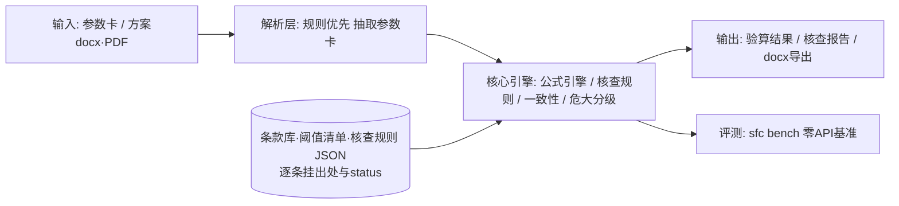

# scaffold-formwork-checker

🚧 **开发中（M0 骨架）** · 脚手架与模板支架安全验算及危大分级工具

[](https://github.com/yuluo554/scaffold-formwork-checker/actions/workflows/ci.yml)

面向施工安全领域的规范驱动桌面工具（Windows，全离线）：

- **安全验算**：JGJ 130-2011 / JGJ 162-2008 规范公式验算（立杆稳定性、水平杆抗弯挠度、连墙件、地基承载力、模板支架立杆稳定），结论逐条挂条款号，计算过程透明；
- **专项方案文本核查**：解析专项施工方案（docx/PDF 文本）为参数卡，对照规范构造限值核查，并检测"方案 vs 验算书"两张皮一致性；
- **危大分级判定**：住建部令第 37 号 + 建办质〔2018〕31 号阈值清单化，三级判定（非危大 / 危大 / 超过一定规模须专家论证），结论挂文件+条款+原文摘录；
- **报告导出**：docx 验算书与核查报告（内置免责声明）。

## 当前状态

M0 可运行骨架（计划文档定稿 + CLI 骨架 + CI）。功能模块按里程碑推进，见下表；详细计划在 [plan/00-README总览.md](plan/00-README总览.md)。

| 里程碑 | 内容 | 状态 |
|---|---|---|
| M1 | 数据先行：条款库（原文核对纪律）+ 危大阈值清单 + 算例真值库 + 合成方案生成器 | ⬜ |
| M2 | 公式引擎：5 个验算模块，算例回归通过率 100% | ⬜ |
| M3 | 方案解析 + 构造限值核查 + 两张皮一致性检测 + 危大分级判定器 | ⬜ |
| M4 | 内置基准 `sfc bench`（零 API 依赖）+ docx 报告导出 | ⬜ |
| M5 | PySide6 桌面应用 + PyInstaller 双 exe | ⬜ |
| M6 | 脱敏发布 GitHub + Release（exe + 演示） | ⬜ |

## 快速开始（当前骨架）

环境要求：Python 3.8+。

Windows（Git Bash / CMD，建议 `py` 启动器）：

```bash
py -m venv .venv
.venv/Scripts/python -m pip install -U pip
.venv/Scripts/python -m pip install -e ".[dev]"
.venv/Scripts/sfc --version
.venv/Scripts/sfc selfcheck
.venv/Scripts/python -m pytest tests -v
```

Linux / macOS：

```bash
python3 -m venv .venv
.venv/bin/python -m pip install -U pip
.venv/bin/python -m pip install -e ".[dev]"
.venv/bin/sfc --version
.venv/bin/sfc selfcheck
```

> 老版本 pip（如 py3.8 自带 20.x）无法可编辑安装 pyproject-only 项目，先执行 `pip install -U pip` 再安装。

## 架构



设计原则：数值结论永远来自确定性规则（零 LLM 通路）；未经原文核对（status）的条文数值不进入计算路径；CLI/GUI 消费同一引擎 API。详见 [plan/03-架构与技术选型.md](plan/03-架构与技术选型.md)。

## 评测基准

⬜ M4 提供 `sfc bench`：算例真值通过率 / 合成方案检出率与误报率 / 危大分级准确率，零 API 依赖、固定 seed、可复现。指标达标后在此表格公开。

## 目录

```
src/scaffold_formwork_checker/   核心包（engine/parse/rules/grading/report/bench/gui 按里程碑就位）
tests/                           pytest（含退出码语义等守门测试）
data/                            条款库·算例库·合成 fixtures（台账见 data/README.md）
plan/                            计划文档（00 总览 / 01 题目 / 02-06 详设 / HANDOFF 交接）
docs/                            技术报告（M5-M6）
```

## 免责声明

本工具定位为**辅助验算与分级工具**，不替代专项施工方案编制、论证与审批。验算与判定结果必须由具备相应资格的专业人员复核后方可使用；工具输出的一切结论均不构成工程决策依据。

## 已知环境问题（Windows）

- `python` 可能指向商店占位符，请用 `py` 启动器；中文控制台建议 `py -X utf8`；
- pip 被系统代理污染（连 127.0.0.1 报错）时：`NO_PROXY="*" no_proxy="*"` 前缀 + 国内镜像（如 `-i https://pypi.tuna.tsinghua.edu.cn/simple`）。

## License

[MIT](LICENSE)
