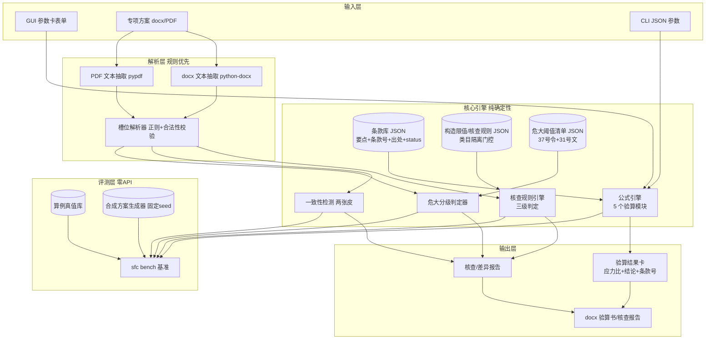

# 03 架构与技术选型

> 原则（承接系列方法论）：**确定性优先**——数值结论永远来自确定性规则/公式，无 LLM 通路；**单一事实源**——引擎 API 是唯一行为源，CLI/GUI/基准都消费它；**数据即代码**——条款库/阈值清单/核查规则全部 JSON 化，扩展=加数据不改引擎。

## 1. 总体架构



## 2. 关键设计决策

| # | 决策 | 内容与理由 |
|---|---|---|
| D1 | 零 LLM 通路 | 与系列前作不同，本题验算=规范公式确定性计算、核查=阈值清单比对、分级=政策清单匹配，**全部可确定性实现**；赛题硬要求"内置基准零 API 依赖"。不接 LLM = 无幻觉面、评测零成本可重复。留 adapter 扩展位（未来文本抽取兜底），首期不实现 |
| D2 | 统一中间表示=参数卡 | 实体-属性-值-单位-置信度-证据。验算输入卡、方案参数卡、验算书取值卡共用同一 schema——"两张皮"检测归约为两卡字段对齐，核查归约为卡×限值表比对 |
| D3 | 条款库三层 | ① 原文全文（本地 raw/，不入公开仓）→ ② 条文块（要点+条款号+出处+status，入仓）→ ③ 机器可读阈值/公式表（引擎消费）。未经原文核对（status≠已核对）的数值不得进入计算路径 |
| D4 | 规则引擎类目隔离门控 | 每条核查规则带 only_if 类目关键词门控（如"落地式钢管脚手架"vs"模板支架"），门控对**全部** check_type 生效，防跨类目误查参数（系列实测踩坑） |
| D5 | CLI 单一入口 | `sfc` 子命令：calc（验算）/ check（方案核查）/ grade（危大分级）/ report（导出）/ bench（基准）/ selfcheck（自检）。退出码语义 0=完成、1=降级完成（结果可用但含待人工确认项）、2=输入不可用/参数错误——**M0 即锁进 CLI 测试**，后续重构不漂移 |
| D6 | GUI 只消费不实现 | PySide6 多页签表单/结果展示，全部调用引擎 API 与 CLI 同一入口函数，不另起第二套行为；GUI 测试 offscreen |
| D7 | 报告产物确定性 | docx 验算书签署栏手填、产物不带时间戳；两次运行逐字节一致可作守门断言（docx zip 内元数据除外需豁免表） |
| D8 | 数据查找冻结分支 | 打包后数据目录查找顺序：显式参数 > 环境变量 > sys._MEIPASS/data（PyInstaller 内嵌）> exe 目录/_internal/data > CWD 上溯；M5 实现时配分支测试锁死 |

## 3. 技术选型

| 层 | 选型 | 理由 | 引入里程碑 |
|---|---|---|---|
| 语言/底线 | Python ≥3.8 | 兼容纪律（系列基准）；PySide6 对 3.8 上限 6.6.3.x，extras 写下限不锁死小版本，构建环境固定用实测版 | M0 |
| 打包/元数据 | setuptools + pyproject.toml（src 布局） | 无 setup.py；仓库根=包根 | M0 |
| 计算 | 纯 Python（float + math），不引 numpy | 截面特性/系数查表即可，零重依赖提升打包与安装成功率 | M2 |
| docx 解析/导出 | python-docx | 同时承担方案文本抽取与验算书生成 | M3/M4 |
| PDF 文本抽取 | pypdf | 纯 Python、轻量；只走文本路线（零识图） | M3 |
| GUI | PySide6 | 赛题指定；offscreen 测试 | M5 |
| exe 打包 | PyInstaller onedir 双 exe | GUI（console=False）+ CLI（console=True）；datas 白名单 + 构建后断言 | M5 |
| 测试 | pytest | extras dev 显式含 pytest（extras 必须覆盖测试期 import） | M0 |
| CI | GitHub Actions 四矩阵 ubuntu/windows × 3.8/3.12 | M0 入仓即配（eol=lf、守门测试齐备→首跑绿的钥匙在开发期） | M0 |

## 4. 仓库布局（仓库根 = 包根）

```
scaffold-formwork-checker/
├── pyproject.toml            # 元数据+extras（dev/parse/report/gui/build）
├── .gitattributes            # * text=auto eol=lf（字节冻结前提）
├── README.md / LICENSE
├── src/scaffold_formwork_checker/
│   ├── __init__.py           # __version__
│   ├── cli.py                # sfc 入口（M0 骨架：--version/selfcheck）
│   ├── engine/               # M2 公式引擎（5 验算模块）
│   ├── parse/                # M3 方案解析（docx/pdf→参数卡）
│   ├── rules/                # M3 核查规则引擎 + 门控
│   ├── grading/              # M3 危大分级判定器
│   ├── consistency/          # M3 两张皮一致性
│   ├── report/               # M4 docx 导出
│   ├── bench/                # M4 基准（算例+合成方案）
│   └── gui/                  # M5 PySide6
├── tests/                    # pytest（含守门测试：exit code/EOL/0外链/构建纪律）
├── data/
│   ├── README.md             # 数据台账（来源+许可+status）
│   ├── knowledge/clauses/    # 条款库 JSON（入仓）
│   ├── knowledge/raw/        # 规范/文件全文——本地留存不入仓（版权红线，gitignore）
│   ├── examples/             # 算例真值库（入仓）
│   └── synthetic/            # 合成方案字节冻结 fixtures（入仓）
├── tools/                    # PyInstaller spec（M5；.gitignore 有 !tools/*.spec 例外）
├── docs/                     # 技术报告（M5-M6）
└── plan/                     # 计划文档（入仓，README 深链前提）
```

## 5. 依赖 extras 分层（运行期真实 import 必须覆盖）

| extras | 包 | 消费方 |
|---|---|---|
| dev | pytest | CI 与本地测试 |
| parse | python-docx、pypdf | M3 方案解析（缺依赖→CLI 带安装提示降级 exit 2，不崩溃） |
| report | python-docx | M4 报告导出 |
| gui | PySide6 | M5 GUI |
| build | pyinstaller | M5 打包 |

纪律：任何测试模块 import 了 extras 依赖，该依赖必须进 dev 或对应 extras 且 CI 显式安装 `.[dev]`+被测 extras；否则 pytest 收集数静默变少（dev 绿 CI 也绿但悄悄少跑）。

## 6. 风险与对策

| 风险 | 对策 |
|---|---|
| 规范条文/公式/系数核对不到官方原文 | 查证纪律：模型记忆只用于定位条号，数值以原文为准；逐字条文 curl 落盘本地提取；两渠道全败→条目标"待核对"继续推进，不空转 |
| 版权（规范全文入库） | 全文只存本地 raw/；入仓=要点+条款号+出处；发布扫描含禁区成分检查 |
| PDF 方案文本抽取质量差（扫描件） | 明确只支持文本型 PDF；解析失败→"待人工确认"降级，不硬判；README 写清限制 |
| PySide6 老解释器上限 | extras 下限不锁死小版本；M5 打包前 spike 实测 pip 可解析最高版本并锁定 |
| CI 首跑环境差异爆发 | M0 配齐 eol=lf / exit code 测试 / extras 完整 / 3.8 兼容写法（不用 3.9+ 运行时语法） |
| scope 失控 | 边界清单（02 §4）+ 危大清单首期只做脚手架/模板相关条目 |
